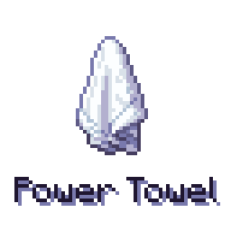
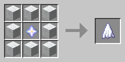
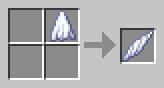
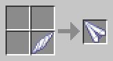

<!--suppress HtmlDeprecatedTag, XmlDeprecatedElement -->

A towel crafted out of Nether Stars to whip these REDACTED and wipe the REDACTED. Made for Modfest: Toybox.

---

The mod adds one, conceptually, item — Power Towel. It can be "folded" into various shapes, each a simple weapon with a
distinct feature.

- Craft the towel from wool and a nether star.

  

- Fold the towel into a shape. Each of the four corners in a crafting grid results in a different one:

  

- You can change freely between the shapes:

  
